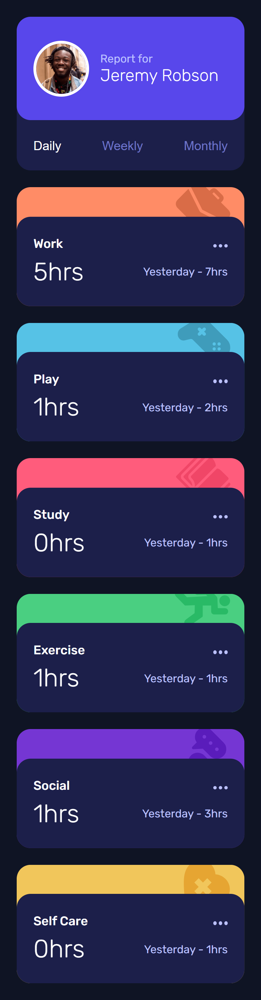
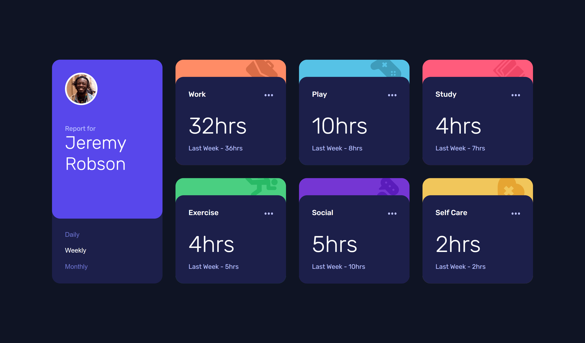

# Frontend Mentor - Time tracking dashboard solution

This is a solution to the [Time tracking dashboard challenge on Frontend Mentor](https://www.frontendmentor.io/challenges/time-tracking-dashboard-UIQ7167Jw). Frontend Mentor challenges help you improve your coding skills by building realistic projects. 

## Table of contents

- [Overview](#overview)
  - [The challenge](#the-challenge)
  - [Screenshot](#screenshot)
  - [Links](#links)
- [My process](#my-process)
  - [Built with](#built-with)
  - [What I learned](#what-i-learned)
  - [Useful resources](#useful-resources)
- [Author](#author)

## Overview

### The challenge

Users should be able to:

- View the optimal layout for the site depending on their device's screen size
- See hover states for all interactive elements on the page
- Switch between viewing Daily, Weekly, and Monthly stats

### Screenshot

### Links
- [Solution URL](https://www.frontendmentor.io/solutions/time-tracker-with-react-typescript-sass-and-bem-WUjP1EZCxK)
- [Live Site URL](https://time-tracker.justinfowlerart.com/)

## My process

### Built with

- [React](https://reactjs.org/) - JS library
- [TypeScript](https://www.typescriptlang.org/) - JS Superset
- [SASS](https://sass-lang.com/) - CSS Preprocessor

### What I learned

My goal for this project was a take a fairly straightforward design and use it to learn SASS. Since I had not worked with CSS preprocessors before, this was a great project to learn the basics and sprinkle in some more interesting design patterns like extend, mixins, and for loops. I also took this opportunity to learn and implement the BEM naming conventions to keep my scss organized.

### Useful resources

- [Understanding CSS BEM](https://codeburst.io/understanding-css-bem-naming-convention-a8cca116d252) - Includes practical guidance on how the BEM naming convention is structured, as well as how to use it in relation to SASS.
- [media query in scss](https://iqcode.com/code/css/media-query-in-scss) - Examples of ways to use media queries in SASS with mixins or variables.
- [Sass/SCSS for, each & while loops (Iteration Control) Tutorial](https://www.koderhq.com/tutorial/sass/iteration-control/#each) - Examples of how loops work in SASS and how to use them to map things like a font size variable to multiple h tags or more interestingly to map over colors based on nth child position.

## Author

- Website - [Justin Fowler Art](https://www.justinfowlerart.com)